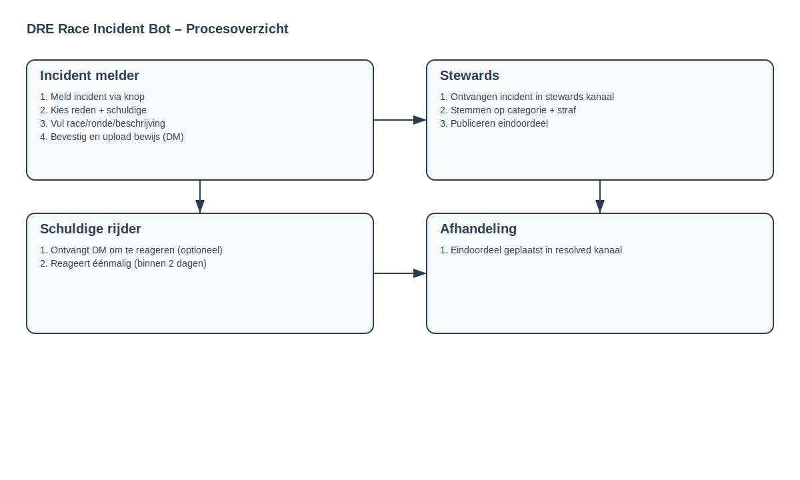

# Uitleg DRE Race Incident Bot

## Algemene uitleg
De DRE Race Incident Bot ondersteunt het hele incident‑proces in Discord. Rijders kunnen incidenten melden, bewijs uploaden en stewards kunnen stemmen en een besluit nemen. De schuldige rijder kan tijdens de behandeling éénmalig reageren via DM (binnen 2 dagen).

De bot verzorgt:
- een duidelijke meldflow voor incidenten;
- een bewijs‑flow via DM;
- een stemproces voor stewards;
- publicatie van uitslagen in het resolved kanaal (incl. divisie);
- optionele logging van incidenten in Google Sheets (status wordt bijgewerkt bij afhandeling);
- een optionele DM‑reactie van de schuldige tijdens de behandeling.

## Incident melder – stappen
1) Ga naar het meld‑kanaal en klik op **Meld Incident**.
2) Geef aan in welke divisie je rijdt: **Div 1**, **Div 2**, **Div 3**, **Div 4**.
3) Kies de reden van het incident.
4) Selecteer de schuldige rijder.
5) Vul race‑nummer, ronde, bocht en beschrijving in.
6) Controleer je melding en bevestig.
7) Het incident verschijnt als forum‑post in het stewards forumkanaal met een eigen thread + stemknoppen. De divisie wordt meegegeven.
8) Je ontvangt een DM om bewijs te uploaden (link of bijlage). Dit bewijs komt zichtbaar in de incident‑thread.
9) Na het eindoordeel verschijnt de uitslag in het resolved kanaal, inclusief divisie.

## Infographic (Mermaid)
```mermaid
flowchart LR
  A[Incident melder] --> B[Meld incident via knop]
  B --> C[Kies divisie (Div 1-4)]
  C --> D[Kies reden + schuldige]
  D --> E[Vul race/ronde/bocht/beschrijving]
  E --> F[Bevestig + upload bewijs (DM)]
  F --> G[Forum post + incident thread]
  G --> H[Bewijs naar incident thread]
  H --> I[Stemmen + eindoordeel + divisie]
  I --> J[Resolved kanaal + divisie]
```

## Infographic (SVG)

